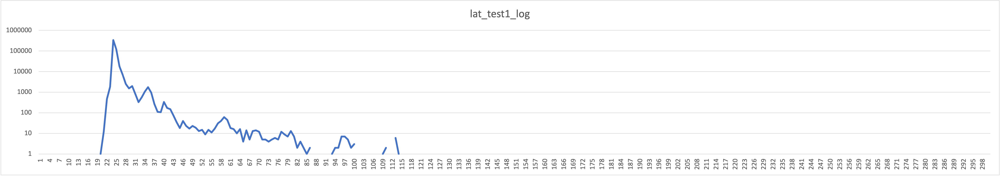
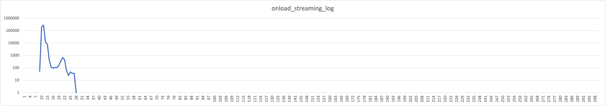

# um_lat - test programs to measure the latency of Ultra Messaging.

Tools for measuring the latency of Ultra Messaging (UM) persistence
and streaming.


# Table of contents

<!-- mdtoc-start -->
&bull; [um_lat - test programs to measure the latency of Ultra Messaging.](#um_lat---test-programs-to-measure-the-latency-of-ultra-messaging)  
&bull; [Table of contents](#table-of-contents)  
&nbsp;&nbsp;&nbsp;&nbsp;&bull; [Copyright and License](#copyright-and-license)  
&nbsp;&nbsp;&nbsp;&nbsp;&bull; [Repository](#repository)  
&nbsp;&nbsp;&nbsp;&nbsp;&bull; [Introduction](#introduction)  
&nbsp;&nbsp;&nbsp;&nbsp;&nbsp;&nbsp;&nbsp;&nbsp;&bull; [Environment](#environment)  
&nbsp;&nbsp;&nbsp;&nbsp;&nbsp;&nbsp;&nbsp;&nbsp;&bull; [Requirements](#requirements)  
&nbsp;&nbsp;&nbsp;&nbsp;&nbsp;&nbsp;&nbsp;&nbsp;&bull; [Build Test Tools](#build-test-tools)  
&nbsp;&nbsp;&nbsp;&nbsp;&nbsp;&nbsp;&nbsp;&nbsp;&bull; [CPU Affinities](#cpu-affinities)  
&nbsp;&nbsp;&nbsp;&nbsp;&nbsp;&nbsp;&nbsp;&nbsp;&bull; [Update Configuration File](#update-configuration-file)  
&nbsp;&nbsp;&nbsp;&nbsp;&nbsp;&nbsp;&nbsp;&nbsp;&nbsp;&nbsp;&nbsp;&nbsp;&bull; [UM Configuration File](#um-configuration-file)  
&nbsp;&nbsp;&nbsp;&nbsp;&bull; [Test Streaming](#test-streaming)  
&nbsp;&nbsp;&nbsp;&nbsp;&nbsp;&nbsp;&nbsp;&nbsp;&bull; [Kernel Driver](#kernel-driver)  
&nbsp;&nbsp;&nbsp;&nbsp;&nbsp;&nbsp;&nbsp;&nbsp;&bull; [Onload Driver](#onload-driver)  
&nbsp;&nbsp;&nbsp;&nbsp;&bull; [Java](#java)  
&nbsp;&nbsp;&nbsp;&nbsp;&bull; [Measurement Outliers](#measurement-outliers)  
&nbsp;&nbsp;&nbsp;&nbsp;&nbsp;&nbsp;&nbsp;&nbsp;&bull; [Interruptions](#interruptions)  
&nbsp;&nbsp;&nbsp;&nbsp;&bull; [Tool Notes](#tool-notes)  
&nbsp;&nbsp;&nbsp;&nbsp;&nbsp;&nbsp;&nbsp;&nbsp;&bull; [um_lat_ping.c](#um_lat_pingc)  
&nbsp;&nbsp;&nbsp;&nbsp;&nbsp;&nbsp;&nbsp;&nbsp;&bull; [um_lat_pong.c](#um_lat_pongc)  
<!-- TOC created by '/home/sford/bin/mdtoc.pl README.md' (see https://github.com/fordsfords/mdtoc) -->
<!-- mdtoc-end -->

## Copyright and License

All of the documentation and software included in this and any
other Informatica Ultra Messaging GitHub repository
Copyright (C) Informatica. All rights reserved.

Permission is granted to licensees to use
or alter this software for any purpose, including commercial applications,
according to the terms laid out in the Software License Agreement.

This source code example is provided by Informatica for educational
and evaluation purposes only.

THE SOFTWARE IS PROVIDED "AS IS" AND INFORMATICA DISCLAIMS ALL WARRANTIES
EXPRESS OR IMPLIED, INCLUDING WITHOUT LIMITATION, ANY IMPLIED WARRANTIES OF
NON-INFRINGEMENT, MERCHANTABILITY OR FITNESS FOR A PARTICULAR
PURPOSE.  INFORMATICA DOES NOT WARRANT THAT USE OF THE SOFTWARE WILL BE
UNINTERRUPTED OR ERROR-FREE.  INFORMATICA SHALL NOT, UNDER ANY CIRCUMSTANCES,
BE LIABLE TO LICENSEE FOR LOST PROFITS, CONSEQUENTIAL, INCIDENTAL, SPECIAL OR
INDIRECT DAMAGES ARISING OUT OF OR RELATED TO THIS AGREEMENT OR THE
TRANSACTIONS CONTEMPLATED HEREUNDER, EVEN IF INFORMATICA HAS BEEN APPRISED OF
THE LIKELIHOOD OF SUCH DAMAGES.

## Repository

See https://github.com/UltraMessaging/um_lat for code and documentation.

## Introduction

Informatica used the tools in this repository to measure the
latency for streaming and persistent sources,
the results of which are outlined in this document.

For maximum sustainable throughput testing, see https://github.com/UltraMessaging/um_perf

These tools test latency under load.
The "ping" tool sends messages at a desired constant rate,
and the "pong" tool receives them and re-publishes (reflects) them back.
As the "ping" tool receives the reflected messages,
it calculates the round-trip latency.

The latencies are accumulated in a histogram so that percentiles can be
calculated.

The tests described below were run on Informatica hardware and gave the
following results:

* 12.1 microseconds one-way latency (with kernel network driver)
* 5.1 microseconds one-way latency (with Onload network driver)


### Environment

The commands and scripts in this repository assume four environment
variables are set up: LBM_LICENSE_INFO, LBM, LD_LIBRARY_PATH, and CP.

Here's an example of setting them up:
````
export LD_LIBRARY_PATH LBM_LICENSE_INFO LBM CP
LBM_LICENSE_INFO="Product=LBM,UME,UMQ,UMDRO:Organization=UM RnD sford (RnD):Expiration-Date=never:License-Key=xxxx xxxx xxxx xxxx"
# Path to the install directory for the UM platform.
LBM="/home/sford/UMP_6.14/Linux-glibc-2.17-x86_64"
LD_LIBRARY_PATH="$LBM/lib"
CP="-classpath .:/home/sford/UMP_6.14/java/UMS_6.14.jar"
````

### Requirements

1. 2 Linux-based hosts (X86, 64-bit).
8 gigabytes or more memory.
These should be "bare metal" machines, NOT virtual machines.
2. 10-gigabit network.
For the lowest latency, a kernel-bypass network driver is recommended.
(We use Solarflare NICs and Open Onload driver.)
3. C compiler (gcc) and related tools.
4. Java SDK (java and javac).
5. Ultra Messaging version 6.14 or beyond,
including development files (lbm.h, libraries, etc.).
It is possible to use pre-6.14, but some work will need to
be done to the configuration and possibly the code.
Contact UM Support.

### Build Test Tools

Copy the "lbm.sh.example" to "lbm.sh" and modify per your environment.

The "bld.sh" script can be used to build the tools.
It relies on the "LBM" and "CP" [environment variables](#environment).

For C programmers, the Java step may be omitted by editing "bld.sh" and
removing the java build.

For Java programmers, we recommend also building and testing with our C
application for comparison purposes.


### CPU Affinities

To get the lowest latency, you should set your thread affinities to
CPUs that are "close" to the NIC.
See [Choose CPUs](https://github.com/UltraMessaging/um_perf#choose-cpus)
for advice on how to determine which CPUs are closest to the NIC.

On our test systems, CPU numbers 4 and 12 are the closest,
so you will see those CPU numbers referenced in the example commands
("-A" and "-a" options for um_lat_ping, "-a" for um_lat_pong).
You should substitute your optimal CPUs.

### Update Configuration File

Contact your network administration group and request three multicast groups
that you can use exclusively.
You don't want your testing to interfere with others,
and you don't want others' activities to interfere with your test.

Also, take note of the publisher's 10G interface IP address.
Ours is 10.29.4.121.
It is usually possible to mask off the final 8 bits and use the CIDR form
of the network address.
For example: "10.29.4.0/24".
All hosts can typically use this on the same LAN.

#### UM Configuration File

The file "um.xml" should be modified.
Here is an excerpt:
````
<?xml version="1.0" encoding="UTF-8" ?>
<um-configuration version="1.0">
  <templates>
    <template name="um_perf">
      <options type="context"> 
        <option name="resolver_multicast_interface" default-value="10.29.4.0/24"/>
        <option name="request_tcp_interface" default-value="10.29.4.0/24"/>
        <option name="resolver_multicast_address" default-value="239.101.3.1"/>
...
  <applications>
    <application name="um_perf" template="um_perf">
      <contexts>
        <context>
          <sources>
            <topic topicname="topic1">
              <options type="source">
                <option name="transport_lbtrm_multicast_address" default-value="239.101.3.2"/>
...
````
Search this file for "10.29" to find all lines that contain a network address.
Change them for your network.

Search this file for "239" to find all lines that contain multicast groups.
We use multicast groups "239.101.3.xx".
Change those to the group provided by your network admins.

WARNING:
The "um.xml" configuration is designed for ease of performing the desired
tests, and is not suitable for production.
It does not contain proper tunings for many other options.
It uses multicast topic resolution for ease of setting up the test,
even though we typically recommend the use of
[TCP-based topic resolution](https://ultramessaging.github.io/currdoc/doc/Design/topicresolutiondescription.html#tcptr).

We recommend conducting a configuration workshop with Informatica.


## Test Streaming

These tests are conducted with the following parameters:
* Publish rate: 50,000 msgs/sec.
* Message size: 24 bytes.
* Number of messages: 500,000 (preceded by 5 "warmup" messages).


### Kernel Driver

This test uses Solarflare NIC but not Onload.
Just the regular kernel network driver is used.

**System 1 (pong)**

Enter:
````
./um_lat_pong -s f -x um.xml -a 12 -E
````

** System 2 (ping)**

````
./um_lat_ping -s f -A 4 -a 12 -x um.xml -m 24 -n 500000 -r 50000 -w 5,5 -H 300,1000 >ping.log; tail ping.log
````

Here's a sample of the output:
````
...
o_histogram=300,1000, hist_overflows=0, hist_min_sample=19991, hist_max_sample=115171,
hist_num_samples=500000, average_sample=24134,
Percentiles: 90=25000, 99=34000, 99.9=51000, 99.99=83000, 99.999=113000
actual_sends=500000, duration_ns=9999983492, result_rate=49999.982540, global_max_tight_sends=6, max_flight_size=500004
Rcv: num_rcv_msgs=500004, num_rx_msgs=0, num_unrec_loss=0,
````

This demonstrates 24,134 nanoseconds (24.1 microseconds) round-trip latency.
A reasonable approximation of the one-way latency is simply half that: 12.1
microseconds.

Note the percentiles, with 99.999% of samples being below 113,000 nanoseconds.
We will see less jitter using Onload.

**Histogram**

The "-H 300,1000" command-line option tells the tool to use 300 buckets with
1000 nanoseconds for each bucket.
Thus, the "ping.log" contains 300 lines of histogram output,
with each line indicating the number of samples with latencies
within that bucket's range.
For example, in the above test run, the 24th histogram line
is:
````
337551
````
This means that of the 500,000 round-trip measurements,
337,551 were between 24.0 and 24.999 microseconds.

I imported the 300 lines into Excel and created the following chart:


Let's change the Y axis to logarithmic to reveal the latency outliers:

Remember that a logarithmic scale greatly exaggerates small values.
For example, the spike at bucket 113 only has a value of 6,
meaning that only 6 of the 500,000 round trips had
latency between 112,000 and 112,999 nanoseconds.


### Onload Driver

This test uses Solarflare NIC and Onload.
The latencies are significantly lower because the NIC is accessed in user mode,
bypassing the kernel.

**System 1 (pong)**

Enter:
````
EF_POLL_USEC=-1 onload ./um_lat_pong -x um.xml -a 12 -E
````

**System 2 (ping)**

````
EF_POLL_USEC=-1 onload ./um_lat_ping -A 4 -a 12 -x um.xml -m 24 -n 500000 -r 50000 -w 5,5 -H 300,1000 >ping.log; tail ping.log
````

Here's a sample of the output:
````
...
o_histogram=300,1000, hist_overflows=0, hist_min_sample=8746, hist_max_sample=27440,
hist_num_samples=500000, average_sample=10138,
Percentiles: 90=10000, 99=12000, 99.9=21000, 99.99=25000, 99.999=26000
actual_sends=500000, duration_ns=9999981187, result_rate=49999.994065, global_max_tight_sends=1, max_flight_size=500004
Rcv: num_rcv_msgs=500004, num_rx_msgs=0, num_unrec_loss=0,
````

This demonstrates 10,138 nanoseconds (10.1 microseconds) round-trip latency.
A reasonable approximation of the one-way latency is simply half that: 5.1
microseconds.
This is a significant improvement over the kernel driver.
But also look at the percentiles.
Onload greatly reduces the latency outliers.

**Histogram**

Here's the Excel chart:


And here's the same chart with a logarithmic Y axis to emphasize outliers:


Compared to the kernel results, Onload greatly reduces latency outliers.
Note that the Ultra Messaging code executes the same in both cases.
I.e. UM does not "know" that it is being used with Onload.
The greater latency jitter produced by the kernel driver is purely
the result of calling into the kernel.


## Java

The Java programs are mostly straightforward translations of the
C code and style to Java code and style.

Note that these commands depend on the [environment variables](#environment)
set previously, including the "CP" variable.

Differences from C usage:
* Our testing has suggested that using "sequential mode" provides a small
latency benefit, so the Java program adds the "-S" option to use that mode.
* Java does not support setting thread affinity, and our experimentation
has suggested that setting affinity externally to a single CPU is bad for
latency.
So we remove the "-A" and "-a" options and use the "taskset" command to limit
the program to a set of CPUs that are "close" to the NIC.


**System 1 (pong)**

Enter:
````
java $CP UmLatPong -s f -x um.xml -E -S
````

**System 2 (ping)**

````
taskset 7,8,9,10,11,12,14 java $CP UmLatPing -s f -x um.xml -m 24 -n 500000 -r 50000 -w 5,5 -H 300,1000 -S >ping.log; tail ping.log
````

Here's a sample of the output:
````
...
optHistogram=300,1000, histOverflows=18, histMinSample=20789, histMaxSample=528731,
histNuMSamples=500000, averageSample=23552,
Percentiles: 90=25000, 99=34000, 99.9=56000, 99.99=128000, 99.999=-1
actualSends=500000, durationNs=9999984551, resultRate=49999.977244964844, globalMaxTightSends=5, maxFlightSize=500005,
Rcv: numRcvMsgs=500004, numRxMsgs=0, numUnrecLoss=0
````

Note the "-1" value for the 99.999 percentile.
That's because of the 18 histogram overflows,
meaning we don't know what their latencies are.
With 500,000 messages, 99.999% represents 499,995.
So anything over five overflows means we can't calculate the 99.999%.

As you can see, when measured to microsecond resolution, C and Java perform
the same up to the 99th percentile.
After that, Java shows greater outliers.


## Measurement Outliers

The UM transport code used with these tests provide a very constant
execution time per message.
Dynamic memory (malloc/free) is not used during message transfer.
There is very little cause for measurement outliers
(jitter) in the UM code itself.

However, the measurements made at Informatica show outliers.
Two environmental factors cause these outliers:
* Interruptions.
* Memory contention and cache invalidation.

### Interruptions

There are many sources of execution interruptions on a CPU core running
a typical OS (Linux or Windows).
Some of them are actual hardware interrupts, like page faults,
disk controllers, NICs, and timers.
Others are soft, like virtual memory maintenance,
scheduler-related operations, and potentially even system
or user processes "stealing" time from the main application.
It is possible to eliminate or at least reduce many of these sources of
interrupt by modifying the host's configuration,
both in its BIOS and the kernel.
For example, see:
* https://lwn.net/Articles/549580/
* https://lwn.net/Articles/659490/
* https://www.kernel.org/doc/Documentation/timers/NO_HZ.txt

There are many other kernel tweaks and optimizations that can be made
to prevent interruptions and allow the application to minimize instances
of giving up the CPU.
Informatica recommends that users work with an experienced Linux performance
engineer to understand the tradeoffs of potential optimizations.
However, Informatica does not know of any way to eliminate
all interruptions.

Without doing these optimizations,
the test results are highly susceptible to interruptions.

See [Measure System Interruptions](https://github.com/UltraMessaging/um_perf#measure-system-interruptions)
for a method to measure these interruptions.


## Tool Notes

There are two tools: "um_lat_ping" and "um_lat_pong".
The "ping" tool sends messages at a fixed rate,
and the "pong" tool reflects them back.
All the latency calculations are done in the "ping" tool.

### um_lat_ping.c

The um_lat_ping tool prints a brief help when the "-h" flag is supplied:
````
Usage: um_lat_ping [-h] [-A affinity_src] [-a affinity_rcv] [-c config]
  [-g] -H hist_num_buckets,hist_ns_per_bucket [-l linger_ms] -m msg_len
  -n num_msgs [-p persist_mode] [-R rcv_thread] -r rate [-s spin_method]
  [-w warmup_loops,warmup_rate] [-x xml_config]
Where (those marked with 'R' are required):
  -h : print help
  -A affinity_src : CPU number (0..N-1) for send thread (-1=none)
  -a affinity_rcv : CPU number (0..N-1) for receive thread (-1=none)
  -c config : configuration file; can be repeated
  -g : generic source
R -H hist_num_buckets,hist_ns_per_bucket : send time histogram
  -l linger_ms : linger time before source delete
R -m msg_len : message length
R -n num_msgs : number of messages to send
  -p persist_mode : '' (empty)=streaming, 'r'=RPP, 's'=SPP
  -R rcv_thread : '' (empty)=main context, 'x'=XSP
R -r rate : messages per second to send
  -s spin_method : '' (empty)=no spin, 'f'=fd mgt busy
  -w warmup_loops,warmup_rate : messages to send before measurement
  -x xml_config : XML configuration file
````

You can modify send rate, message length, number of messages, etc.

This tool has two "hot" threads: sender (main) and
receiver (configurable between context or XSP).

Each message is loaded with a nanosecond-resolution timestamp.
When the reflected message is received, a new timestamp is
taken, and the message's timestamp is subtracted.
This gives the round-trip duration.

By default, the tool uses Smart Sources for sending messages.
The "-g" command-line option switches to generic sources.

The main thread sends messages using a busy-looping algorithm.
This evenly spaces the messages, even at high message rates.
It also consumes 100% of the CPU that it is running on.

The receive thread can be configured to do busy looping
via the command-line option "-s f",
which tells the tool to add the configuration option:
````
<option name="file_descriptor_management_behavior" default-value="busy_wait"/>
````
This lowers the latency by eliminating the kernel scheduler wakeup overhead.
It also consumes 100% of the CPU that it is running on.

Thus, the um_lat_ping tool consumes 100% of two CPUs.

We recommend using the "-w warmup_loops,warmup_rate" command-line option.
This exercises the desired number of ping/pong loops without accumulating
statistics.
This prevents the statistics from being artificially increased due to
OS and CPU startup issues, like demand paging and cache misses.
We have found that a small number like 5 is usually enough.


### um_lat_pong.c

The um_lat_pong tool prints a brief help when the "-h" flag is supplied:
````
Usage: um_lat_pong [-h] [-a affinity_rcv] [-c config] [-E] [-g]
  [-p persist_mode] [-R rcv_thread] [-s spin_method] [-x xml_config]
Where:
  -h : print help
  -a affinity_rcv : CPU number (0..N-1) for receive thread (-1=none)
  -c config : configuration file; can be repeated
  -E : exit on EOS
  -g : generic source
  -p persist_mode : '' (empty)=streaming, 'r'=RPP, 's'=SPP
  -R rcv_thread : '' (empty)=main context, 'x'=XSP
  -s spin_method : '' (empty)=no spin, 'f'=fd mgt busy
  -x xml_config : configuration file
````

This tool has one "hot" thread: receiver
(configurable between context or XSP).
The main thread initializes and then sleeps forever.
All the work of receiving messages and reflecting them back is 
done in the receiver thread.

By default, the tool uses Smart Sources for sending messages.
The "-g" command-line option switches to generic sources.

The receive thread can be configured to do busy looping
via the command-line option "-s f",
which tells the tool to add the configuration option:
````
<option name="file_descriptor_management_behavior" default-value="busy_wait"/>
````
This lowers the latency by eliminating the kernel scheduler wakeup overhead.
It also consumes 100% of the CPU that it is running on.
(When using Onload, configuring Onload for busy looping is preferred over
configuring UM for "file_descriptor_management_behavior busy_wait".)

Thus, the um_lat_pong tool consumes 100% of one CPU.
