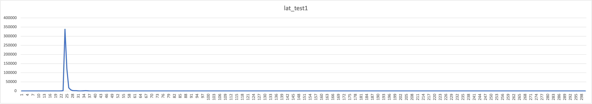

# um_lat - test programs to measure the latency of Ultra Messaging.

Tools for measuring the latency of Ultra Messaging (UM) persistence
and streaming.

# Table of contents

- [um_lat - test programs to measure the latency of Ultra Messaging.](#um_lat---test-programs-to-measure-the-latency-of-ultra-messaging)
- [Table of contents](#table-of-contents)
  - [COPYRIGHT AND LICENSE](#copyright-and-license)
  - [REPOSITORY](#repository)
  - [INTRODUCTION](#introduction)
    - [ENVIRONMENT](#environment)
    - [Requirements](#requirements)
    - [BUILD TEST TOOLS](#build-test-tools)
    - [CPU AFFINITIES](#cpu-affinities)
    - [Update Configuration File](#update-configuration-file)
      - [UM Configuration File](#um-configuration-file)
  - [TEST](#test)
    - [KERNEL DRIVER](#kernel-driver)
      - [System 1 (pong)](#system-1-pong)
      - [System 2 (ping)](#system-2-ping)
      - [Histogram](#histogram)
    - [ONLOAD DRIVER](#onload-driver)
      - [System 1 (pong)](#system-1-pong)
      - [System 2 (ping)](#system-2-ping)
      - [Histogram](#histogram)
  - [MEASUREMENT OUTLIERS](#measurement-outliers)
    - [Interruptions](#interruptions)
  - [TOOL NOTES](#tool-notes)
    - [UM_LAT_PING.C](#um_lat_pingc)
    - [UM_LAT_PONG.C](#um_lat_pongc)

<sup>(table of contents from https://luciopaiva.com/markdown-toc/)</sup>

## COPYRIGHT AND LICENSE

All of the documentation and software included in this and any
other Informatica Ultra Messaging GitHub repository
Copyright (C) Informatica. All rights reserved.

Permission is granted to licensees to use
or alter this software for any purpose, including commercial applications,
according to the terms laid out in the Software License Agreement.

This source code example is provided by Informatica for educational
and evaluation purposes only.

THE SOFTWARE IS PROVIDED "AS IS" AND INFORMATICA DISCLAIMS ALL WARRANTIES
EXPRESS OR IMPLIED, INCLUDING WITHOUT LIMITATION, ANY IMPLIED WARRANTIES OF
NON-INFRINGEMENT, MERCHANTABILITY OR FITNESS FOR A PARTICULAR
PURPOSE.  INFORMATICA DOES NOT WARRANT THAT USE OF THE SOFTWARE WILL BE
UNINTERRUPTED OR ERROR-FREE.  INFORMATICA SHALL NOT, UNDER ANY CIRCUMSTANCES,
BE LIABLE TO LICENSEE FOR LOST PROFITS, CONSEQUENTIAL, INCIDENTAL, SPECIAL OR
INDIRECT DAMAGES ARISING OUT OF OR RELATED TO THIS AGREEMENT OR THE
TRANSACTIONS CONTEMPLATED HEREUNDER, EVEN IF INFORMATICA HAS BEEN APPRISED OF
THE LIKELIHOOD OF SUCH DAMAGES.

## REPOSITORY

See https://github.com/UltraMessaging/um_lat for code and documentation.

## INTRODUCTION

Informatica used the tools in this repository to measure the
latency for streaming and persistent sources,
the results of which are outlined in this document.

For maximum sustainable throughput testing, see https://github.com/UltraMessaging/um_perf

These tools test latency under load.
The "ping" tool sends messages at a desired constant rate,
and the "pong" tool receives them and re-publishes (reflects) them back.
As the "ping" tool receives the reflected messages,
it calculates the round-trip latency.

The latencies are accumulated in a histogram so that percentiles can be
calculated.

The tests described below were run on Informatica hardware and gave the
following results:

* 12.1 microseconds one-way latency (with kernel network driver)
* 4.25 microseconds one-way latency (with Onload user-mode driver)


### ENVIRONMENT

The commands and scripts in this repository assume four environment
variables are set up: LBM_LICENSE_INFO, LBM, LD_LIBRARY_PATH, and PATH.

Here's an example of setting them up:
````
export LD_LIBRARY_PATH LBM_LICENSE_INFO LBM PATH

LBM_LICENSE_INFO="Product=LBM,UME,UMQ,UMDRO:Organization=UM RnD sford (RnD):Expiration-Date=never:License-Key=xxxx xxxx xxxx xxxx"

# Path to the install directory for the UM platform.
LBM="/home/sford/UMP_6.14/Linux-glibc-2.17-x86_64"

if [ -z "$LD_LIBRARY_PATH" ]
  then LD_LIBRARY_PATH="$LBM/lib"
  else LD_LIBRARY_PATH="$LBM/lib:$LD_LIBRARY_PATH"
fi

PATH="$LBM/bin:$PATH"
````

### Requirements

1. 5 Linux-based hosts (X86, 64-bit).
16 gigabytes or more memory.
At least one host must have a fast disk.
These should be "bare metal" machines, NOT virtual machines.
2. C compiler (gcc) and related tools.
3. Ultra Messaging version 6.14, including development files (lbm.h,
libraries, etc.).

See [Test Hardware](#informatica-test-hardware) for details of Informatica's
test hosts.

### BUILD TEST TOOLS

The "bld.sh" script can be used to build the tools.
It relies on the "LBM" [environment variable](#environment).

### CPU AFFINITIES

To get the lowest latency, you should set your thread affinities to
CPUs that are "close" to the NIC.
See [Choose CPUs](https://github.com/UltraMessaging/um_perf#choose-cpus)
for advice on how to determine which CPUs are closest to the NIC.

On our test systems, CPU numbers 4 and 12 are the closest.

The "um_lat_ping" and "um_lat_pong" tools generally have two threads
during normal execution.
In the demonstrations that follow, the "taskset" command is used to
set affinity for the "main" thread, and the "-a" command-line option
is used to set affinity for the "context" thread.

### Update Configuration File

Contact your network administration group and request three multicast groups
that you can use exclusively.
You don't want your testing to interfere with others,
and you don't want others' activities to interfere with your test.

Also, take note of the publisher's 10G interface IP address.
Ours is 10.29.4.121.
It is usually possible to mask off the final 8 bits and use the CIDR form
of the network address.
For example: "10.29.4.0/24".
All hosts can typically use this on the same LAN.

#### UM Configuration File

The file "um.xml" should be modified.
Here is an excerpt:
````
<?xml version="1.0" encoding="UTF-8" ?>
<um-configuration version="1.0">
  <templates>
    <template name="um_perf">
      <options type="context"> 
        <option name="resolver_multicast_interface" default-value="10.29.4.0/24"/>
        <option name="request_tcp_interface" default-value="10.29.4.0/24"/>
        <option name="resolver_multicast_address" default-value="239.101.3.1"/>
...
  <applications>
    <application name="um_perf" template="um_perf">
      <contexts>
        <context>
          <sources>
            <topic topicname="topic1">
              <options type="source">
                <option name="transport_lbtrm_multicast_address" default-value="239.101.3.2"/>
...
````
Search this file for "10.29" to find all lines that contain a network address.
Change them for your network.

Search this file for "239" to find all lines that contain multicast groups,
and "10.29" for other site-specific IPs.

We use multicast groups "239.101.3.xx".
Change those to the group provided by your network admins.

WARNING:
The "um.xml" configuration is designed for ease of performing the desired
tests, and is not suitable for production.
It does not contain proper tunings for many other options.
It uses multicast topic resolution for ease of setting up the test,
even though we typically recommend the use of
[TCP-based topic resolution](https://ultramessaging.github.io/currdoc/doc/Design/topicresolutiondescription.html#tcptr).

We recommend conducting a configuration workshop with Informatica.


## TEST

### KERNEL DRIVER

This test uses Solarflare NIC but not Onload.
Just the regular kernel network driver is used.

#### System 1 (pong)

Enter:
````
taskset -c 4 ./um_lat_pong -x um.xml -a 12
````

#### System 2 (ping)

````
taskset -c 4 ./um_lat_ping -a 12 -x um.xml -m 24 -n 500000 -r 50000 -w 5,5 -H 300,1000 >ping.log; tail ping.log
````

Here's a sample of the output:
````
Core-9941-2212: specified smart source retention buffer count of 101000 will be increased to the next highest power of two: 131072
Core-10403-150: Context (0x1e32540) created with ContextID (2670192184) and ContextName [(NULL)]
Core-9941-2212: specified smart source retention buffer count of 101000 will be increased to the next highest power of two: 131072
0
0
0
0
0
0
o_histogram=300,1000, hist_overflows=0, hist_min_sample=20803, hist_max_sample=90719,
hist_num_samples=500000, average_sample=24320,
actual_sends=500000, duration_ns=9999983930, result_rate=49999.980350, global_max_tight_sends=8, max_flight_size=500004
Rcv: num_rcv_msgs=500004, num_rx_msgs=0, num_unrec_loss=0,
````

This demonstrates 24320 nanoseconds (24.3 microseconds) round-trip latency.
A reasonable approximation of the one-way latency is simply half that: 12.1
microseconds.

#### Histogram

To get percentiles, the "um_lat_pong" tool maintains a histogram of
latencies.
The "-H 300,1000" command-line option tells the tool to use 300 buckets with
1000 nanoseconds for each bucket.
Thus, the "ping.log" contains 300 lines, with each line indicating the number
of samples with latencies within that bucket's range.
For example, in the above test run, the 25th histogram line
is:
````
281488
````
This means that of the 500,000 round-trip measurements, 281,488 were between 24.9 and 25.0 microseconds.

I imported the 300 lines into Excel and created the following chart:


### ONLOAD DRIVER

This test uses Solarflare NIC and Onload.
The latencies are significantly lower because the NIC is accessed in user mode,
bypassing the kernel.

#### System 1 (pong)

Enter:
````
EF_POLL_USEC=-1 taskset -c 4 onload ./um_lat_pong -x um.xml -a 12
````

#### System 2 (ping)

````
EF_POLL_USEC=-1 taskset -c 4 .onload ./um_lat_ping -a 12 -x um.xml -m 24 -n 500000 -r 50000 -w 5,5 -H 300,1000 >ping.log; tail ping.log
````

Here's a sample of the output:
````
oo:um_lat_ping[17899]: Using OpenOnload 7.0.0-pON11504 [4]
oo:um_lat_ping[17899]: Copyright 2006-2019 Solarflare Communications, 2002-2005 Level 5 Networks
Core-7911-1: Onload extensions API has been dynamically loaded
Core-9941-2212: specified smart source retention buffer count of 101000 will be increased to the next highest power of two: 131072
Core-10403-150: Context (0x27be120) created with ContextID (4063600122) and ContextName [(NULL)]
Core-9941-2212: specified smart source retention buffer count of 101000 will be increased to the next highest power of two: 131072
0
0
0
0
0
0
o_histogram=300,1000, hist_overflows=0, hist_min_sample=8188, hist_max_sample=30437,
hist_num_samples=500000, average_sample=8537,
actual_sends=500000, duration_ns=9999980898, result_rate=49999.995510, global_max_tight_sends=1, max_flight_size=500004
Rcv: num_rcv_msgs=500004, num_rx_msgs=0, num_unrec_loss=0, 
````

This demonstrates 8537 nanoseconds (8.5 microseconds) round-trip latency.
A reasonable approximation of the one-way latency is simply half that: 4.25
microseconds.

#### Histogram

Here's the Excel chart:


## MEASUREMENT OUTLIERS

The SmartSource transport code is written to provide a very constant
execution time.
Dynamic memory (malloc/free) is not used during message transfer.
There is very little cause for measurement outliers
(jitter) in the SmartSource code itself.

However, the measurements made at Informatica show significant outliers.
Two environmental factors cause these outliers:
* Interruptions.
* Memory contention and cache invalidation.

### Interruptions

There are many sources of execution interruptions on a CPU core running
a typical OS (Linux or Windows).
Some of them are actual hardware interrupts, like page faults,
disk controllers, NICs, and timers.
Others are soft, like virtual memory maintenance,
scheduler-related operations, and potentially even system
or user processes "stealing" time from the main application.
It is possible to eliminate or at least reduce many of these sources of
interrupt by modifying the host's configuration,
both in its BIOS and the kernel.
For example, see:
* https://lwn.net/Articles/549580/
* https://lwn.net/Articles/659490/
* https://www.kernel.org/doc/Documentation/timers/NO_HZ.txt

There are many other kernel tweaks and optimizations that can be made
to prevent interruptions and allow the application to minimize instances
of giving up the CPU.
Informatica recommends that users work with an experienced Linux performance
engineer to understand the tradeoffs of potential optimizations.
However, Informatica does not know of any way to eliminate
all interruptions.

Without doing these optimizations,
the test results are highly susceptible to interruptions.

See [Measure System Interruptions](https://github.com/UltraMessaging/um_perf#measure-system-interruptions)
for a method to measure these interruptions.


## TOOL NOTES

There are two tools: "um_lat_ping" and "um_lat_pong".
The "ping" tool sends messages at a fixed rate,
and the "pong" tool reflects them back.
All the latency calculations are done in the "ping" tool.

### UM_LAT_PING.C

The um_lat_ping tool prints a brief help when the "-h" flag is supplied:
````
Usage: um_lat_ping [-h] [-a affinity_cpu] [-c config] [-g] [-H hist_num_buckets,hist_ns_per_bucket] [-l linger_ms] [-m msg_len] [-n num_msgs] [-p persist_mode] [-r rate] [-w warmup_loops,warmup_rate] [-x xml_config]
where:
  -h : print help
  -a affinity_cpu : bitmap for CPU affinity for send thread [-1]
  -c config : configuration file; can be repeated []
  -g : generic source [0]
  -H hist_num_buckets,hist_ns_per_bucket : send time histogram [0,0]
  -l linger_ms : linger time before source delete [1000]
  -m msg_len : message length [0]
  -n num_msgs : number of messages to send [0]
  -p ''|r|s : persist mode (empty=streaming, r=RPP, s=SPP) []
  -r rate : messages per second to send [0]
  -w warmup_loops,warmup_rate : messages to send before measurement [0,0]
  -x xml_config : XML configuration file []
````

You can modify send rate, message length, number of messages, etc.

This tool has two "hot" threads: main and context.
The main thread sends messages,
and the context thread receives the reflected messages.

Each message is loaded with a nanosecond-resolution timestamp.
When the reflected message is received, a new timestamp is
taken, and the message's timestamp is subtracted.
This gives the round-trip duration.

By default, the tool uses Smart Sources for sending messages.
The "-g" command-line option switches to generic sources.

The main thread sends messages using a busy-looping algorithm.
This evenly spaces the messages, even at high message rates.
It also consumes 100% of the CPU that it is running on.

The context thread is also configured to do busy looping
via the configuration option:
````
<option name="file_descriptor_management_behavior" default-value="busy_wait"/>
````
This lowers the latency by eliminating the kernel scheduler wakeup overhead.
It also consumes 100% of the CPU that it is running on.

Thus, the um_lat_ping tool consumes 100% of two CPUs.

We recommend using the "-w warmup_loops,warmup_rate" command-line option.
This exercises the desired number of ping/pong loops without accumulating
statistics.
This prevents the statistics from being artificially increased due to
OS and CPU startup issues, like demand paging and cache misses.
We have found that a small number like 5 suffices.


### UM_LAT_PONG.C

The um_lat_pong tool prints a brief help when the "-h" flag is supplied:
````
Usage: um_lat_pong [-h] [-a affinity_cpu] [-c config] [-E] [-g] [-p persist_mode] [-x xml_config]
where:
  -h : print help
  -a affinity_cpu : CPU number (0..N-1) for receive thread [-1]
  -c config : configuration file; can be repeated []
  -E : exit on EOS [0]
  -g : generic source [0]
  -p ''|r|s : persist mode (empty=streaming, r=RPP, s=SPP) []
  -x xml_config : configuration file []
````

This tool has one "hot" thread: context.
The main thread initializes the tool and then sleeps forever.
All the work of receiving messages and reflecting them back is 
done in the context thread.

By default, the tool uses Smart Sources for sending messages.
The "-g" command-line option switches to generic sources.

The context thread is configured to do busy looping
via the configuration option:
````
<option name="file_descriptor_management_behavior" default-value="busy_wait"/>
````
This lowers the latency by eliminating the kernel scheduler wakeup overhead.
It also consumes 100% of the CPU that it is running on.

Thus, the um_lat_pong tool consumes 100% of one CPU.
