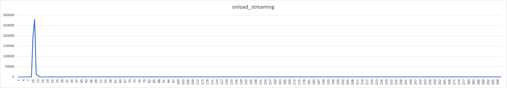

# um_lat - test programs to measure the latency of Ultra Messaging.

Tools for measuring the latency of Ultra Messaging (UM) persistence
and streaming.

# Table of contents

<sup>(table of contents from https://luciopaiva.com/markdown-toc/)</sup>

## COPYRIGHT AND LICENSE

All of the documentation and software included in this and any
other Informatica Ultra Messaging GitHub repository
Copyright (C) Informatica. All rights reserved.

Permission is granted to licensees to use
or alter this software for any purpose, including commercial applications,
according to the terms laid out in the Software License Agreement.

This source code example is provided by Informatica for educational
and evaluation purposes only.

THE SOFTWARE IS PROVIDED "AS IS" AND INFORMATICA DISCLAIMS ALL WARRANTIES
EXPRESS OR IMPLIED, INCLUDING WITHOUT LIMITATION, ANY IMPLIED WARRANTIES OF
NON-INFRINGEMENT, MERCHANTABILITY OR FITNESS FOR A PARTICULAR
PURPOSE.  INFORMATICA DOES NOT WARRANT THAT USE OF THE SOFTWARE WILL BE
UNINTERRUPTED OR ERROR-FREE.  INFORMATICA SHALL NOT, UNDER ANY CIRCUMSTANCES,
BE LIABLE TO LICENSEE FOR LOST PROFITS, CONSEQUENTIAL, INCIDENTAL, SPECIAL OR
INDIRECT DAMAGES ARISING OUT OF OR RELATED TO THIS AGREEMENT OR THE
TRANSACTIONS CONTEMPLATED HEREUNDER, EVEN IF INFORMATICA HAS BEEN APPRISED OF
THE LIKELIHOOD OF SUCH DAMAGES.

## REPOSITORY

See https://github.com/UltraMessaging/um_lat for code and documentation.

## INTRODUCTION

Informatica used the tools in this repository to measure the
latency for streaming and persistent sources,
the results of which are outlined in this document.

For maximum sustainable throughput testing, see https://github.com/UltraMessaging/um_perf

The tests described below were run on Informatica hardware and gave the
following results:

* 12.1 microseconds one-way latency (with kernel network driver)
* 4.25 microseconds one-way latency (with Onload user-mode driver)


## ENVIRONMENT

The commands and scripts in this repository assume four environment
variables are set up: LBM_LICENSE_INFO, LBM, LD_LIBRARY_PATH, and PATH.

Here's an example of setting them up:
````
export LD_LIBRARY_PATH LBM_LICENSE_INFO LBM PATH

LBM_LICENSE_INFO="Product=LBM,UME,UMQ,UMDRO:Organization=UM RnD sford (RnD):Expiration-Date=never:License-Key=xxxx xxxx xxxx xxxx"

# Path to the install directory for the UM platform.
LBM="/home/sford/UMP_6.14/Linux-glibc-2.17-x86_64"

if [ -z "$LD_LIBRARY_PATH" ]
  then LD_LIBRARY_PATH="$LBM/lib"
  else LD_LIBRARY_PATH="$LBM/lib:$LD_LIBRARY_PATH"
fi

PATH="$LBM/bin:$PATH"
````

## CPU AFFINITIES

To get the lowest latency, you should set your thread affinities to
CPUs that are "close" to the NIC.
See https://github.com/UltraMessaging/um_perf for advice on how to determine
which CPUs are closest to the NIC.

On our test systems, CPU numbers 4 and 12 are closest.

The "um_lat_ping" and "um_lat_pong" tools generally have two threads
during normal execution.
In the demonstrations the follow, the "taskset" command is used to
set affinity for the "main" thread, and the "-a" command-line option
is used to set affinity for the "context" thread.


## TEST

### KERNEL DRIVER

This test uses Solarflare NIC but not Onload.
Just the regular kernal network driver is used.

#### System 1 (pong)

Enter:
````
taskset -c 4 ./um_lat_pong -x um.xml -a 12
````

#### System 2 (ping)

````
taskset -c 4 ./um_lat_ping -a 12 -x um.xml -m 24 -n 500000 -r 50000 -w 5,5 -H 300,1000 >ping.log; tail ping.log
````

Here's a sample of the output:
````
Core-9941-2212: specified smart source retention buffer count of 101000 will be increased to the next highest power of two: 131072
Core-10403-150: Context (0x1e32540) created with ContextID (2670192184) and ContextName [(NULL)]
Core-9941-2212: specified smart source retention buffer count of 101000 will be increased to the next highest power of two: 131072
0
0
0
0
0
0
o_histogram=300,1000, hist_overflows=0, hist_min_sample=20803, hist_max_sample=90719,
hist_num_samples=500000, average_sample=24320,
actual_sends=500000, duration_ns=9999983930, result_rate=49999.980350, global_max_tight_sends=8, max_flight_size=500004
Rcv: num_rcv_msgs=500004, num_rx_msgs=0, num_unrec_loss=0,
````

This demonstrates 24320 nanoseconds (24.3 microseconds) round-trip latency.
A reasonable approximation of the one-way latency is simply half that: 12.1
microseconds.

#### Histogram

To get percentiles, the "um_lat_pong" tool maintains a histogram of
latencies.
The "-H 300,1000" command-line option tells the tool to use 300 buckets with
1000 nanoseconds for each bucket.
Thus, the "ping.log" contains 300 lines, with each line indicating the number
of samples with latencies within that bucket's range.
For example, in the above test test run, the 25th histogram line
is:
````
281488
````
This means that of the 500,000 round-trip measurements, 281,488 were between 24.9 and 25.0 microseconds.

I imported the 300 lines into Excel and created the following chart:


### ONLOAD DRIVER

This test uses Solarflare NIC and Onload.
The latencies are significantly lower because the NIC is accessed in user mode,
bypassing the kernel.

#### System 1 (pong)

Enter:
````
EF_POLL_USEC=-1 taskset -c 4 onload ./um_lat_pong -x um.xml -a 12
````

#### System 2 (ping)

````
EF_POLL_USEC=-1 taskset -c 4 .onload ./um_lat_ping -a 12 -x um.xml -m 24 -n 500000 -r 50000 -w 5,5 -H 300,1000 >ping.log; tail ping.log
````

Here's a sample of the output:
````
oo:um_lat_ping[17899]: Using OpenOnload 7.0.0-pON11504 [4]
oo:um_lat_ping[17899]: Copyright 2006-2019 Solarflare Communications, 2002-2005 Level 5 Networks
Core-7911-1: Onload extensions API has been dynamically loaded
Core-9941-2212: specified smart source retention buffer count of 101000 will be increased to the next highest power of two: 131072
Core-10403-150: Context (0x27be120) created with ContextID (4063600122) and ContextName [(NULL)]
Core-9941-2212: specified smart source retention buffer count of 101000 will be increased to the next highest power of two: 131072
0
0
0
0
0
0
o_histogram=300,1000, hist_overflows=0, hist_min_sample=8188, hist_max_sample=30437,
hist_num_samples=500000, average_sample=8537,
actual_sends=500000, duration_ns=9999980898, result_rate=49999.995510, global_max_tight_sends=1, max_flight_size=500004
Rcv: num_rcv_msgs=500004, num_rx_msgs=0, num_unrec_loss=0, 
````

This demonstrates 8537 nanoseconds (8.5 microseconds) round-trip latency.
A reasonable approximation of the one-way latency is simply half that: 4.25
microseconds.

#### Histogram

Here's the Excel chart:

